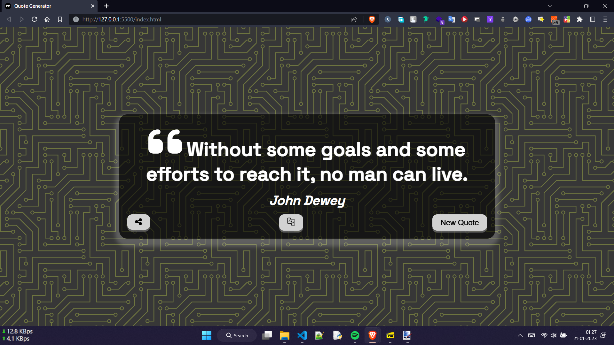

<h1 align='center'>💬Quote Generator</h1>

We all need motivation and encouragement from time to time, and if you don't need either of these at the moment, you certainly have friends or family who could benefit from both. If you're looking for some motivational quotes or inspirational quotes to positively influence your day, this is the right place. This is exactly what this Random Motivational Quotes Generator is able to do.
 
 

<h2>⚒️Built with:</h2>
https://fullydeepak.github.io/vannila-js-projects/Quote-Generator/
 
 
<h2>🖼️Screenshot:</h2>
- Mobile - Light  

- Mobile - Dark  

- Desktop - Light  

- Desktop - Dark  

 
<h2>⚒️Built with:</h2>

- This is build using vanilla HTML, CSS and JavaScript.
- Using Forismatic API
- Using Google Translate API

<h2>😎Features:</h2>

- Generate as many as Random Quotes
- Share generated quote on WhatsApp, Twitter, Facebook or via your OS provided share function.
- Translate generated quotes to Hindi language and also share it.
- Feel the vibration while pressing buttons
- Determine light or dark theme according to your device or browser.
